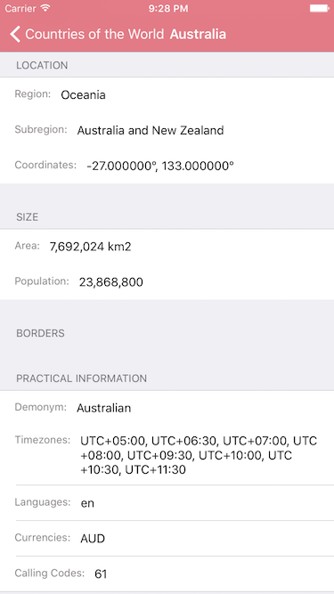

####Test for viagogo iOS Developer

1. Fetch countries from Rest Countries API
2. Lazy loading of images
3. Images cache in memory
4. Display country data within a grouped UITableView
5. Index for country list tableView
6. Dynamic height of cells
7. Memory warning handling
8. Use of KVC 
9. Pull to refresh
10. Unit Tests
11. Storyboards and autolayout
12. Navigation bar customisation

####Some screenshots

